# PeerStone Deployment Guide

This guide explains the optimized CI/CD pipeline for PeerStone wallet deployment.

## 🚀 Deployment Architecture

### GitHub Actions (Quality Checks)
- **Purpose**: Code quality validation
- **Runs on**: Every push and pull request
- **Actions**:
  - ✅ Linting (`npm run lint`)
  - ✅ Type checking (`npx tsc --noEmit`)
  - ✅ Future: Unit tests (`npm test`)
  - 🚀 Triggers Vercel deployment (main branch only)

### Vercel (Build & Deploy)
- **Purpose**: Application build and hosting
- **Triggers**: Via webhook from GitHub Actions
- **Actions**:
  - 📦 Install dependencies (`npm ci`)
  - 🔨 Build application (`npm run build`)
  - 🌐 Deploy to production

## 🔧 Environment Variables Setup

### Required Variables in Vercel

You need to set these environment variables in your Vercel project settings:

#### 1. Blockchain Configuration
```bash
NEXT_PUBLIC_MEMPOOL_HOST=https://mempool.aiblock.dev
NEXT_PUBLIC_STORAGE_HOST=https://storage.aiblock.dev
NEXT_PUBLIC_VALENCE_HOST=https://valence.aiblock.dev
```

#### 2. Supabase Authentication (Required for build)
```bash
NEXT_PUBLIC_SUPABASE_URL=your_supabase_project_url
NEXT_PUBLIC_SUPABASE_ANON_KEY=your_supabase_anon_key
```

### How to Set Environment Variables in Vercel

1. **Go to Vercel Dashboard**
   - Navigate to your PeerStone project
   - Click **Settings** tab

2. **Add Environment Variables**
   - Go to **Environment Variables** section
   - Click **Add New**
   - Add each variable with these settings:
     - **Name**: Variable name (e.g., `NEXT_PUBLIC_SUPABASE_URL`)
     - **Value**: Your actual value
     - **Environments**: Select **Production**, **Preview**, and **Development**

3. **Required Variables**:
   
   | Variable Name | Description | Example |
   |---------------|-------------|---------|
   | `NEXT_PUBLIC_SUPABASE_URL` | Your Supabase project URL | `https://abc123.supabase.co` |
   | `NEXT_PUBLIC_SUPABASE_ANON_KEY` | Your Supabase anonymous key | `eyJhbGci...` |
   | `NEXT_PUBLIC_MEMPOOL_HOST` | AIBlock mempool endpoint | `https://mempool.aiblock.dev` |
   | `NEXT_PUBLIC_STORAGE_HOST` | AIBlock storage endpoint | `https://storage.aiblock.dev` |
   | `NEXT_PUBLIC_VALENCE_HOST` | AIBlock valence endpoint | `https://valence.aiblock.dev` |

4. **Redeploy**
   - After adding variables, trigger a new deployment
   - Either push to main branch or use Vercel's redeploy button

## 🔄 Deployment Flow

```mermaid
graph LR
    A[Push to GitHub] --> B[GitHub Actions]
    B --> C{Quality Checks}
    C -->|✅ Pass| D[Trigger Vercel]
    C -->|❌ Fail| E[Block Deployment]
    D --> F[Vercel Build]
    F --> G[Deploy to Production]
```



### Step-by-Step Process

1. **Developer pushes code** to main branch
2. **GitHub Actions runs**:
   - Installs dependencies
   - Runs ESLint linting
   - Runs TypeScript type checking
   - If all pass → triggers Vercel deployment
   - If any fail → blocks deployment

3. **Vercel receives webhook**:
   - Clones latest code
   - Installs dependencies with environment variables
   - Builds application (requires Supabase env vars)
   - Deploys to production

## 🛠️ Local Development

For local development, create a `.env.local` file:

```bash
# Copy from .env.local.example or see SUPABASE_SETUP.md
NEXT_PUBLIC_SUPABASE_URL=your_supabase_project_url
NEXT_PUBLIC_SUPABASE_ANON_KEY=your_supabase_anon_key

# These are automatically set by vercel.json in production
NEXT_PUBLIC_MEMPOOL_HOST=https://mempool.aiblock.dev
NEXT_PUBLIC_STORAGE_HOST=https://storage.aiblock.dev
NEXT_PUBLIC_VALENCE_HOST=https://valence.aiblock.dev
```

## 🚨 Troubleshooting

### Common Issues

1. **"supabaseUrl is required" during build**
   - ❌ Supabase environment variables not set in Vercel
   - ✅ Add `NEXT_PUBLIC_SUPABASE_URL` and `NEXT_PUBLIC_SUPABASE_ANON_KEY`

2. **Build succeeds but auth doesn't work**
   - ❌ Environment variables set incorrectly
   - ✅ Verify values in Vercel settings match your Supabase project

3. **GitHub Actions fail**
   - ❌ Linting or type errors in code
   - ✅ Fix issues locally and push again

4. **Deployment doesn't trigger**
   - ❌ GitHub Actions failed
   - ✅ Check Actions tab in GitHub for error details

### Debugging Steps

1. **Check GitHub Actions logs**: Go to Actions tab in your GitHub repo
2. **Check Vercel deployment logs**: Go to Deployments in Vercel dashboard
3. **Verify environment variables**: Check Vercel Settings → Environment Variables
4. **Test locally**: Run `npm run build` locally with proper `.env.local`

## 🔐 Security Notes

- ✅ **Environment variables are secure**: Vercel encrypts and securely stores them
- ✅ **Build-time inclusion**: `NEXT_PUBLIC_*` vars are included in client bundle
- ✅ **No secrets in code**: Sensitive values are never committed to Git
- ⚠️ **Public variables**: `NEXT_PUBLIC_*` vars are visible in client-side code

## 📞 Support

If you encounter issues:

1. Check this deployment guide
2. Review `SUPABASE_SETUP.md` for authentication setup
3. Check Vercel and GitHub Actions logs
4. Verify all environment variables are correctly set

---

**Next Steps**: 
1. Set up Supabase project (see `SUPABASE_SETUP.md`)
2. Configure Vercel environment variables
3. Push code to trigger deployment 